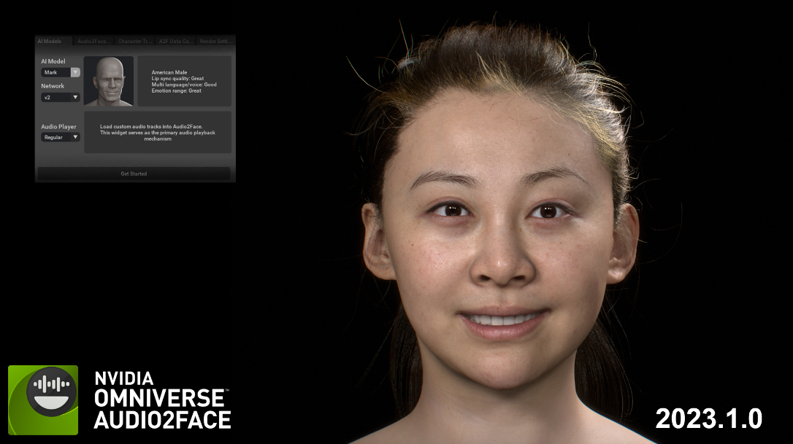

# 数字人主要技术整理

**中文** | [**English**](./README_en.md)  

目前数字人主要包括形象、声音和对话能力几方面。主要交互方式为直接与数字人进行对话。以下从多方面进行了收集和总结，以期提供快速入门帮助。

## 0. 实时感知交互能力

### 0.1 GPT4o

随着[GPT-4o](https://openai.com/index/hello-gpt-4o/)的一系列演示视频的发布，几乎解决了实时性的问题，通过**实时对话、打断、主动提问，以及实时分析摄像头内容**，结合本地知识库、Agent等能力，让数字人一下子达到了更高级别的可用性。

**无需实体形象的可用场景（可穿戴设备：实时采集、云端处理、语音及图像反馈）：**

- 个人实时助手
- 盲人助手
- 翻译助手
- 学生学习辅导
- 其他（欢迎提交补充）

**需要实体形象的可用场景：**

- 数字人赋能，但是目前还未有技术能解决数字人的互动能力，比如实时往嘴上涂口红，自由镜头下的多角度运动等
- 实体机器人赋能，如救援机器人的自主决策、和控制人员通过自然语言或特定语法进行交流等。
- 其他

目前OpenAI还**暂未提供演示中涉及的声音和视频的API**，而只提供了GPT4o的文字对话和图片识别能力，相较于之前的GPT4-Vision-Preview等区别不大。

相应演示视频：

<https://player.bilibili.com/player.html?isOutside=true&aid=1454557368&bvid=BV1Vi421X7Xf&cid=1544530003&p=1>

### 0.2 其他实现

tbd

## 1. 形象驱动

### 1.1 真人录制+算法驱动

真人出镜录制素材视频，后期通过对AI驱动口型和姿态等方式实现数字人

- 优点：难辨真假（因为是直接录制的真人素材），口型对得准，可实时直播也可录播。
- 缺点：贵（可能）

> 本图片中右侧为数字人，左侧为真人

相应演示视频：

<https://player.bilibili.com/player.html?isOutside=true&aid=701718909&bvid=BV1vm4y1x7nm&cid=1217022011&p=1>

---

**相关技术：**

- 唇形同步Lip Sync技术（代表：[Wav2Lip](https://github.com/Rudrabha/Wav2Lip)、[HeyGen](https://www.heygen.com/)、[rask.ai](https://rask.ai/)）
- 实时视频换脸（代表：[DeepFakeLive](https://www.deepfakevfx.com/downloads/deepfacelive/)、[FaceFusion](https://github.com/facefusion/facefusion)、[fal.ai](https://fal.ai/models/fal-ai/fast-turbo-diffusion/playground)）
- 图片转视频（代表：[MuseTalk](https://github.com/TMElyralab/MuseTalk)、[Sadtalker](https://github.com/OpenTalker/SadTalker)）

### 1.2 建模+算法驱动

建模有更高的自由度，有高精度建模和低精度建模等各种方式丰俭由人，也可以另辟蹊径建造卡通形象等。

**代表技术：**

[Meta Human](https://www.unrealengine.com/en-US/metahuman)

 [NVIDIA Omniverse Audio2Face](https://www.nvidia.com/en-us/omniverse/apps/audio2face/)

[Live2D](https://www.live2d.com/en/)

[Adobe Character Animator](https://www.adobe.com/hk_en/products/character-animator.html)

## 2. 声音模仿

**一些非专业的背景知识补充：**  
数字人声音可使用现有模型的TTS，或使用自训练的声音模型。声学模型是声音合成系统的重要组成部分。

主流声学模型包括[VITS](https://github.com/jaywalnut310/vits)、[Tacotron](https://github.com/NVIDIA/DeepLearningExamples/tree/master/PyTorch/SpeechSynthesis/Tacotron2)、[FastSpeech2](https://github.com/ming024/FastSpeech2)等。VITS（Variational Inference with adversarial learning for end-to-end Text-to-Speech）是一种语音合成方法，它使用预先训练好的语音编码器 (vocoder声码器) 将文本转化为语音。

之前流行的AI孙燕姿等，采用技术为[so-vits-svc](https://github.com/svc-develop-team/so-vits-svc/tree/4.1-Stable)，全称SoftVC VITS Singing Voice Conversion。该技术是一个声音爱好者基于[softVC](https://github.com/bshall/soft-vc)和[VITS](https://github.com/jaywalnut310/vits)修改而来。

### 声音模仿相关热点项目（截止2024.6）

**1. GPT-SoVITS** *27.0K stars*  
声音模型训练项目，少量文本即可实现微调模型，提供WebUI。

**项目地址：** <https://github.com/RVC-Boss/GPT-SoVITS>  

**演示视频：**

<https://player.bilibili.com/player.html?isOutside=true&aid=836354039&bvid=BV12g4y1m7Uw&cid=1406840960&p=1>

**2. so-vits-svc** *24.4K stars*  
声音模型训练项目，代表：AI孙燕姿。

**项目地址：** <https://github.com/svc-develop-team/so-vits-svc>  

**演示视频：**

<https://player.bilibili.com/player.html?isOutside=true&aid=572772327&bvid=BV1Mz4y1p7hY&cid=1178460068&p=1>

**3. ChatTTS** *23.3K stars*  
非声音克隆。但是其文字转声音效果非常好，有停顿，有语气，有情绪。原生中文支持。网络提供了Windows、Linux等各种一键部署包、懒人包等。

**项目地址：** <https://github.com/2noise/ChatTTS>  

**演示视频：**

<https://player.bilibili.com/player.html?isOutside=true&aid=1055092304&bvid=BV1zn4y1o7iV&cid=1561584918&p=1>

**其他：**[剪映capcut声音克隆](https://www.capcut.cn/)、[睿声Reecho](https://www.reecho.ai/)、[Emotional VITS](https://github.com/innnky/emotional-vits)、[Bark](https://github.com/suno-ai/bark)

## 3. 互动技术

**tbd**  
*如多镜头多角度下的数字人、实时换装、化妆等。*

## 4. 应用场景及综合代表项目

数字人在自媒体（知识科普等相关口播博主）、电商直播带货、教育教学领域有所应用。在数字生命（已故亲人）等领域（和AR、VR等结合）也有探索。此外，数字人技术和实体机器人的融合等也是题中应有之义。

**代表项目：**

1. [AI-Vtuber](https://github.com/Ikaros-521/AI-Vtuber)  

【开源】AI Vtuber是一个由大模型驱动的、融合外观、声音的虚拟AI主播

2. [Fay](https://github.com/TheRamU/Fay)  
【开源】Fay是一个完整的开源项目，包含Fay控制器及数字人模型，可灵活组合出不同的应用场景：虚拟主播、现场推销货、商品导购、语音助理、远程语音助理、数字人互动、数字人面试官及心理测评、贾维斯、Her。

3. [HeyGen](https://www.heygen.com/)  
【海外/华人创办】

4. [特看科技](https://www.zhubobao.com/)  
【国产商用】基于真人视频的高质量数字人

5. [腾讯智影](https://zenvideo.qq.com/)  
【国产商用】融合多种AIGC能力的综合创作平台。

## 5. 法律法规、代表性新闻

- **[《互联网信息服务深度合成管理规定》](https://www.gov.cn/zhengce/zhengceku/2022-12/12/content_5731431.htm)**  
*深度合成服务提供者和技术支持者提供智能对话、合成人声、人脸生成、沉浸式拟真场景等生成或者显著改变信息内容功能的服务的，应当进行显著标识，避免公众混淆或者误认*

- **[《北京市促进数字人产业创新发展行动计划》](https://www.beijing.gov.cn/zhengce/zhengcefagui/202208/W020220808406785112297.pdf)**  
*北京市经济和信息化局发布国内首个数字人产业专项支持政策——《北京市促进数字人产业创新发展行动计划（2022—2025年）》*
- **[大模型、数字人技术在教育领域中如何得以应用？](https://learning.sohu.com/a/713671752_120619005)**  
*“用科技促进教育发展，让更多人受益，是我们的初心。构建更有效果、更有效率、更有体验感的教育，让全球的学习者都能享有优质数字教育资源。”
8月20日，在2023全球智慧教育大会现场，北京师范大学智慧学习研究院副院长、网龙副总裁陈长杰在接受媒体采访时做了上述表示。*

- **[全球未来教育设计大赛](https://gcd4fe.bnu.edu.cn/)** 项目实际体验使用说明文档（AIGC夏令营&GCD4FE 48H）
*<https://yuanzhuo.bnu.edu.cn/downloads/gcd4fe_ai_story.html>*

## 6. 数字人的大脑 Large Langurage Model

### 目前支持图片识别和处理的多模态模型主要有

gpt-4o，gpt-4-vision-preview，gemini-pro-vision，智浦GLM-4V，零一科技yi-vl-plus，通义千问Qwen-VL-Max、LLaVA（开源）等。

### 各模型API申请地址

- baidu  
<https://console.bce.baidu.com/qianfan/ais/console/applicationConsole/application>

- 360  
<https://ai.360.com/open>

- qwen  
<https://dashscope.console.aliyun.com/overview>

- xinghuo  
<https://console.xfyun.cn/services/bm35>

- zhipu  
<https://open.bigmodel.cn/overview>

- moonshot ai  
<https://platform.moonshot.cn/console/api-keys>

- hunyuan  
<https://console.cloud.tencent.com/cam/capi>

- baichuan  
<https://platform.baichuan-ai.com/console/apikey>

- minimax  
<https://www.minimaxi.com/user-center/basic-information/interface-key>

- 零一  
<https://platform.lingyiwanwu.com/apikeys>

- 阶跃星辰  
<https://platform.stepfun.com>

- claude  
<https://www.anthropic.com/api>

- gemini  
<https://ai.google.dev/gemini-api/docs/api-key>

### 开源大模型集成前端

- **Open-WebUI** 提供丰富功能的WebUI，可集成各类大模型，具有用户组功能，管理员可便捷管理多用户，并收集用户详细使用数据。  
<https://github.com/open-webui/open-webui>

- **Jan** 提供多平台客户端，集成各种开源和API模型，UI美观简单易用  
<https://github.com/janhq/jan>

- **Langchain-Chatchat** 通过WebUI提供多模型支持和RAG、agent等功能。  
<https://github.com/chatchat-space/Langchain-Chatchat>

### 大模型API集成管理网关

- Ollama  
<https://ollama.com>

- LiteLLM  
<https://litellm.vercel.app>

- VLLM  
<https://docs.vllm.ai/en/latest/index.html>

- OneAPI  
<https://github.com/songquanpeng/one-api>

- gateway
<https://github.com/Portkey-AI/gateway>

### 本地知识库和智能体构建

- FastGPT  
<https://github.com/labring/FastGPT>

- dify  
<https://github.com/langgenius/dify>

- Coze  
<https://www.coze.cn>  
<https://www.coze.com>

### 大模型自动化测评工具

- OpenCompass  
<https://github.com/open-compass/opencompass>
